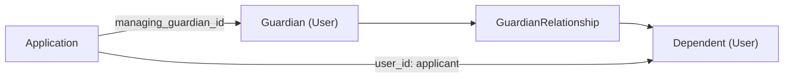

# Guardian Relationship System

A guardian and a dependent are both users.

A `GuardianRelationship` connects them.

An application's `managing_guardian` records who manages that particular application.

One guardian can have several dependents, and one dependent can have several guardians.

## The data model



[`GuardianRelationship`](../../app/models/guardian_relationship.rb) stores `guardian_id`, `dependent_id`, and `relationship_type`. Guardian and dependent are relationship roles, not separate user subclasses.

The [schema](../../db/schema.rb) enforces a unique guardian/dependent pair and foreign keys to users. The model rejects self-guardianship; there is no database check constraint for that rule. `applications.managing_guardian_id` is optional.

[`UserGuardianship`](../../app/models/concerns/user_guardianship.rb) provides `guardians`, `dependents`, and `managed_applications`, plus access and contact helpers. [Application scopes](../../app/models/application.rb) such as `managed_by`, `for_dependents_of`, and `related_to_guardian` support the corresponding application queries.

## Adding a dependent in the portal

A guardian adds a dependent from their own dashboard, before applying for anyone. The dashboard offers **Add a Dependent**, or **Add Another Dependent** once they have one, which opens the form at `/constituent_portal/dependents/new`. The [form](../../app/views/constituent_portal/dependents/_form.html.erb) asks for three things:

- **Dependent information** — first and last name, date of birth, and contact details. *Use my email address* and *Use my phone number* are checked by default; clearing either reveals a field for the dependent's own address or number, plus the phone type (voice, videophone, or text).
- **Disability information** — at least one of hearing, vision, speech, mobility, or cognition. The form will not save without one.
- **Relationship information** — how the guardian is related: parent, grandparent, foster parent, legal guardian, relative caregiver, power of attorney, or other.

**Add Dependent** returns them to the dashboard with "Dependent was successfully created." The dependent now appears under *My dependents* with View and Edit links and an **Apply for …** button. Adding someone does not start an application; that is a separate step.

Behind the button, [`ConstituentPortal::DependentsController#create`](../../app/controllers/constituent_portal/dependents_controller.rb) checks the submitted contact details against existing records, locks the guardian and any candidates a review case would name, derives shared contact from that locked guardian, and then writes the dependent, the relationship, and any review case in one transaction. Nothing is written unless all of it succeeds.

Four things a guardian can see instead of that success message:

| What happened | What they see |
| --- | --- |
| The email or phone already belongs to someone on file | "Unable to complete dependent creation. Please contact the MAT Team for assistance." The wording is deliberately vague: it must not reveal whose record matched. |
| They already have a dependent with this name and date of birth | A message naming that dependent, with the MAT Team's email and phone. Each guardian gets one dependent per name-and-birthdate pair, so genuinely different people who share both are sorted out by staff. |
| They double-clicked, or the browser retried the request | "… was already added to your account." No second person is created — see [Repeated submissions](#repeated-submissions). |
| They submitted a stale page after changing the details | "This form was out of date, so nothing was changed. Please reload the page and try again." |

A fifth case is invisible to the guardian. When the new dependent's name and date of birth resemble an unrelated person already on file, creation succeeds with the ordinary message and staff get a `portal_dependent` review case to look at. The dependent is not reused, the guardian is not told, and the new dependent can still apply — only an open `registration_soft_match` case blocks submission.

### Doing it from the console

Nothing exposes the portal's sequence as a single call, so from `bin/rails console` you create the two records yourself. This shares the guardian's email, which is what the *Use my email address* checkbox does:

```ruby
guardian  = Users::Constituent.find_by(email: 'guardian@example.com')
dependent = Users::Constituent.create!(
  first_name: 'Ada', last_name: 'Lovelace',
  date_of_birth: Date.new(2015, 3, 2),
  hearing_disability: true,
  password: SecureRandom.hex(12),
  email: "dependent-#{SecureRandom.uuid}@system.matvulcan.local",
  dependent_email: guardian.email
)
GuardianRelationship.create!(guardian_user: guardian, dependent_user: dependent,
                             relationship_type: 'Parent')
```

`User` requires a password even for a dependent who will never sign in, and the synthetic primary email is what keeps the shared address from colliding with the guardian's on the unique index. The model's [`UserProfile`](../../app/models/concerns/user_profile.rb) concern requires a disability when the constituent has applications or validation is explicitly requested. Portal creation enables that check; a new console-created record without it can save with none.

This skips everything the form does around the write: duplicate detection, the replay key, the one-per-name-and-birthdate rule, and the review case. That is fine for local setup and fixing data by hand, and wrong as a way to import people. In tests, use `create(:guardian_relationship)` instead.

### Repeated submissions

Each form carries a `portal_creation_key`. The relationship stores that key and a [server-keyed fingerprint](../../app/services/constituent_portal/dependent_request_fingerprint.rb) of the submitted choices.

| Request | Result |
| --- | --- |
| Unused key for this guardian | Continue through normal creation checks. |
| Used key with the same submitted choices | Return the original dependent without new writes. |
| Used key with changed choices | Refuse the stale form without changing either record. |

Keys are scoped to the authenticated guardian, so one guardian's key cannot retrieve another's dependent. The database enforces uniqueness on `(guardian_id, portal_creation_key)` when a key is present, and requires the key and fingerprint to be stored together. Failed creation leaves the key available for a corrected submission.

This replay check is separate from the portal's name/date-of-birth rule: a guardian cannot add another dependent matching one they already hold. [`Users::Constituent.find_duplicates`](../../app/models/users/constituent.rb) defines that comparison. It is a portal admission rule, not a database uniqueness rule shared by all intake channels.

During a duplicate merge, moving a guardian's relationships clears their creation keys because the guardian's request scope has ended. Moving a dependent's relationships preserves the surviving guardian's keys.

## Paper and admin intake

[`PaperApplicationService`](../../app/services/applications/paper_application_service.rb) owns the paper application transaction. Staff select a saved guardian; [guardian quick-create](../../app/services/applications/paper_guardian_quick_create_service.rb) creates new guardians before final submission.

For a new dependent, [`GuardianDependentManagementService`](../../app/services/applications/guardian_dependent_management_service.rb) applies contact choices, checks identity, and saves the dependent and relationship within that transaction. For an existing dependent, the writer requires an on-file relationship to the selected guardian and rechecks [paper application eligibility](../../app/services/applications/paper_application_eligibility.rb). A submitted dependent ID alone does not authorize reuse.

Paper identity decisions use [`PaperIdentityReview`](../../app/services/applications/paper_identity_review.rb) and record applicable keep-separate or existing-person selections in `paper_intake` cases. The new application explicitly identifies its applicant and managing guardian.

Admin relationship creation goes through [`Admin::GuardianRelationshipsController`](../../app/controllers/admin/guardian_relationships_controller.rb) and the shared relationship service, which locks and rechecks both users before inserting the link.

## Canonical stored-contact ownership

Email, phone, and address choices are independent. A dependent might use their own email and their guardian's phone.

[`GuardianDependentManagementService`](../../app/services/applications/guardian_dependent_management_service.rb) writes the contact choices; [`UserGuardianship`](../../app/models/concerns/user_guardianship.rb) interprets the saved fields.

| Choice | Stored representation |
| --- | --- |
| Dependent's own email or phone | The value is mirrored into the primary field and the corresponding `dependent_email` or `dependent_phone` field. |
| Guardian's email or phone | Guardian contact is copied into the corresponding dependent field. Primary fields can contain unique synthetic values to avoid contact-uniqueness collisions. |
| Mailing address | Address fields are copied or retained according to the selected strategy; the strategy itself is not stored. |

Synthetic emails ending in `@system.matvulcan.local` and `000-` phone placeholders are internal values, not delivery destinations. The primary email and phone have unique database indexes; the dependent contact fields allow shared guardian values. See [PII encryption](../security/pii_encryption.md) for field storage and contact lookup.

In paper intake, choosing the dependent's own email or phone requires a usable value. For an existing dependent, omitting the field can retain their real on-file contact; explicitly submitting a blank is refused. Selecting guardian contact does not require a dependent-owned value. [PaperDependentContactChoice](../../app/services/applications/paper_dependent_contact_choice.rb) applies this rule to identity preview and both new- and existing-dependent writes.

`dependent_email_contact` and `dependent_phone_contact` return the **value, owner, and source** together, each field resolved independently within the relevant guardian scope. That is the answer delivery services need — comparing contact values by hand reconstructs it badly, since an address shared between guardian and dependent is ambiguous on its own.

Older rows can lack the dependent contact fields, and the fallback is deliberately asymmetric: email falls back to the contact guardian, while a usable primary phone stays dependent-owned. Paper edits preserve usable primary contacts that staff did not submit replacements for.

Address ownership is conservative because no strategy is persisted: `dependent_mailing_address_owner` chooses the dependent only when their address is complete and the contact guardian's is incomplete; otherwise, with a contact guardian present, it chooses the guardian.

## Delivery, locale, and access

`effective_email`, `effective_phone`, and `effective_phone_type` resolve contact details. Their fallback runs through `guardian_for_contact`, which is simply the dependent's first related guardian — not necessarily the guardian managing a given application, so application-specific delivery uses its own workflow's recipient selection. [`SecureRequestRecipientResolver`](../../app/services/applications/secure_request_recipient_resolver.rb) supplies the managing-guardian context for secure requests.

`effective_locale` follows the owner of the selected email contact. Stored locales are not validated against the locales the app actually ships, so passing one straight to I18n can raise `I18n::InvalidLocale`; `effective_message_locale` narrows it to a supported value or `nil`, leaving the caller to supply the fallback. [`ApplicationForm#message_locale`](../../app/forms/application_form.rb) prefers the submitted locale, then the applicant, then the actor, then the default — and for an existing application the applicant locale comes from its saved applicant.

Contact sharing does not grant login access. Public sign-in requires the user's own eligible email-backed account; see [authentication](../security/authentication_system.md). Portal edits also recheck the guardian, dependent, and relationship under lock so a stale page cannot edit a retired or no-longer-related record.

A `portal_dependent` review case does not block a later application. Only an open `registration_soft_match` case whose subject is the applicant blocks final portal submission. Drafting and editing remain available; a guardian's own review case does not block their dependent by association. See [duplicate review](user_management_features.md#duplicate-review).

## Tests

- [Relationship model](../../test/models/guardian_relationship_test.rb) — pair validation and associations.
- [Portal controller](../../test/controllers/constituent_portal/dependents_controller_test.rb) and [concurrency tests](../../test/controllers/constituent_portal/dependents_controller_concurrency_test.rb) — creation, replay, authorization, competing writes.
- [Guardian/dependent service](../../test/services/applications/guardian_dependent_management_service_test.rb) — contact choices and relationship creation.
- [Secure-request resolver](../../test/services/applications/secure_request_recipient_resolver_test.rb) — recipient and contact ownership.
- [Guardian application flow](../../test/integration/guardian_application_flow_test.rb) — applicant versus managing guardian.

[Relationship factories](../../test/factories/guardian_relationships.rb) build both users by default. A dependent application needs its relationship to exist first, and asserting only `user_id` will pass for a self application too — both it and `managing_guardian_id` have to be checked to prove the dependent case.
