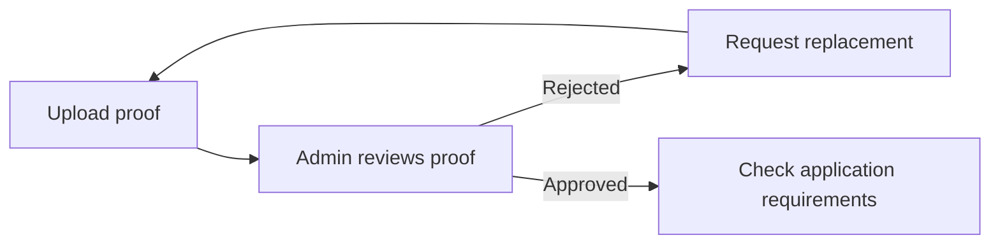

# Proof Review

Staff decide whether an applicant's documents satisfy the program's requirements.

Evidence arrives, an admin approves it or asks for a replacement, and the application advances once everything required is approved.

The wider journey from draft to fulfillment is in the [application workflow guide](application_workflow_guide.md).

## The records

Income, residency, and ID are the reviewable proofs. Residency and ID are always required; income depends on the application's own saved `income_proof_required` flag, not on today's feature setting.

Four things are easy to conflate:

- The **attachment** (`application.residency_proof`) is the file.
- The **status** (`residency_proof_status`) is `not_reviewed`, `approved`, or `rejected`.
- The **[`ProofReview`](../../app/models/proof_review.rb)** is the decision: reviewer, time, and rejection reason. A re-review updates the existing record.
- The **application status** is the whole application's position in its lifecycle. Rejecting one proof is not rejecting the application.

Disability certification is a separate requirement that still goes by `medical_certification` in code, and receiving or signing that document is not the same as approving it.

Status alone does not tell you whether there is a file: [`Application#proof_review_state`](../../app/models/application.rb) combines requirement, attachment, status, and submission history, and the admin flow uses `proof_type_reviewable?` to decide whether a proof can be acted on at all.

## One proof, start to finish

An applicant uploads a residency document; the admin finds it illegible.

A constituent upload lands as `not_reviewed`. The admin's decision goes through `ProofReviewService` to [`Applications::ProofReviewer`](../../app/services/applications/proof_reviewer.rb), which writes both the `ProofReview` and the status column — approval requires an attachment, rejection records an explanation and schedules the rejected file for purging. Rejection handling on `ProofReview` then calls [`Applications::RequestProofResubmission`](../../app/services/applications/request_proof_resubmission.rb), and a replacement arriving through the portal or a secure form returns the proof to `not_reviewed` for another decision.

After an approval the reviewer calls `Application#reconcile_workflow_state!` ([`ApplicationStatusManagement`](../../app/models/concerns/application_status_management.rb)). With required proofs approved and certification outstanding it can move the application to `awaiting_dcf` and request certification; with certification approved too it can approve the application; and it leaves already approved, rejected, or archived applications alone. Reconciliation goes through `transition_status!`, so status history and the transition's side effects come with it — a raw write to `Application#status` gets neither.

## Where documents come from

Attaching a file does not always mean it still needs review — the entry point decides.

| Entry point | Path | Result |
| --- | --- | --- |
| Initial portal application | [`ApplicationCreator#attach_file_uploads`](../../app/services/applications/application_creator.rb) | Attached during creation or update; final submission leaves uploaded proofs `not_reviewed`. |
| Portal submission or replacement | [`ProofsController`](../../app/controllers/constituent_portal/proofs/proofs_controller.rb) → `ProofAttachmentService` | Access and submission limits checked, then attached as `not_reviewed`. |
| Admin paper intake | [`PaperApplicationService`](../../app/services/applications/paper_application_service.rb) → `ProofAttachmentService` | Upload for later review, attach and approve, or reject with a reason and no file. "None Provided" is a rejection reason. Certification uses its own attachment service. |
| Admin scanned upload | [`Admin::ScannedProofsController`](../../app/controllers/admin/scanned_proofs_controller.rb) → `ProofAttachmentService` | Income and residency scans are accepted as **approved**, with the submission recorded in the controller. |
| Public secure upload | [`SecureProofFormsController`](../../app/controllers/secure_proof_forms_controller.rb) → [`SubmitProofResubmission`](../../app/services/applications/submit_proof_resubmission.rb) → `ProofAttachmentService` | Request and file checked, proof attached as `not_reviewed`, request marked submitted. |

Accepted formats and limits also vary by entry point, across [`ProofUploadFormats`](../../app/models/proof_upload_formats.rb), [`ProofManageable`](../../app/models/concerns/proof_manageable.rb), and — for secure uploads — [`ProofAttachmentValidator`](../../app/services/proof_attachment_validator.rb). Controller-level and model-level checks can both apply to the same file.

## Requesting a replacement

[`RequestProofResubmission`](../../app/services/applications/request_proof_resubmission.rb) creates `SecureRequestForm` records and attempts delivery. For a dependent application the applicant, the person receiving the request, and the owner of the contact it is delivered to can all be different people, so [`SecureRequestRecipientResolver`](../../app/services/applications/secure_request_recipient_resolver.rb) picks them and the form stores each role separately. Email and letter are the default channels; SMS requires an explicit choice and an eligible number.

Each form is bound to one application and proof type. Submission requires it to be active, unexpired, unrevoked, and unused, and rechecks that under lock before attaching. A successful upload consumes the request — it does not approve the proof.

**A saved rejection and a delivered request are independent.** Delivery failing does not undo the review; `ProofReviewService` exposes `resubmission_delivered` so admin controllers can warn, and recovery is a resend rather than a re-review.

## Ownership boundaries

- **Review events and attachment events have different owners.** `ProofReview` emits `proof_approved` and `proof_rejected`; upload paths emit attachment and submission events. A second rejection event or send added in the attachment service duplicates history. Approval notifications from `ProofReview` are record-only (`deliver: false`); rejection is what requests replacement proof.
- **Rejection has application-wide consequences.** Repeated rejections feed warning and archive rules in `ProofReview`, even though each rejection judges one document.
- **`Current.paper_context` belongs to paper intake.** Attachment and review code scopes `Current` flags to coordinate validations and callbacks; the flag is not a general validation bypass. A follow-up failure after commit can leave a saved application, and [`PaperApplicationService`](../../app/services/applications/paper_application_service.rb) distinguishes that from a rollback or an unconfirmed write.

Starting points by question: [`ProofAttachmentService`](../../app/services/proof_attachment_service.rb) for how a file attaches and sets status — note it returns a hash with `:success` and `:error`, not the `BaseService::Result` that review and secure-request services return. [`Admin::ProofReviewsController`](../../app/controllers/admin/proof_reviews_controller.rb) and `Admin::ApplicationsController#update_proof_status` for how an admin action becomes a review. [`Application#required_proofs_approved?`](../../app/models/application.rb) for why an application has not advanced. Executable examples: [reviewer](../../test/services/applications/proof_reviewer_test.rb), [review service](../../test/services/proof_review_service_test.rb), and [secure upload](../../test/services/applications/submit_proof_resubmission_test.rb) tests — with real attachments in integration tests, since mocks skip the persistence being tested.

## Scheduled jobs, including the broken ones

[`config/recurring.yml`](../../config/recurring.yml) schedules attachment metrics daily and consistency checks weekly in production. A checked-in schedule is not evidence that the queue worker is running.

| Job | Behavior and limits |
| --- | --- |
| [ProofAttachmentMetricsJob](../../app/jobs/proof_attachment_metrics_job.rb) | Counts income/residency attachment success and failure events over 24 hours. Below 95% success **and** at least five failures it creates admin warning notifications with `deliver: false` — no email. ID and certification events are outside the metric. |
| [ProofConsistencyCheckJob](../../app/jobs/proof_consistency_check_job.rb) | Logs income/residency proofs approved without files, or attached while `not_reviewed`. Its production alert branch calls an undefined `notify_admins`, so finding an inconsistency raises after logging. |
| [ProofReviewReminderJob](../../app/jobs/proof_review_reminder_job.rb) | Would remind admins about applications whose `needs_review_since` passed three days ago. Nothing calls it and nothing schedules it. |
| [CleanupOldProofsJob](../../app/jobs/cleanup_old_proofs_job.rb) | Targets archived applications untouched for 30 days, but calls `purge_proofs` without the admin argument it requires. Unscheduled, and would raise if it ran. |

The last three need repair before anyone relies on them. For a metrics warning that never arrived, the window, covered event types, both thresholds, and notification creation errors are the places to look, with [metrics tests](../../test/jobs/proof_attachment_metrics_job_test.rb) as the reference.

## Related

[Disability certification and DocuSeal](../development/docuseal_integration_guide.md) · [guardian relationships](../development/guardian_relationship_system.md) · [notifications](notifications.md) · [audit events](audit_event_tracking.md)
